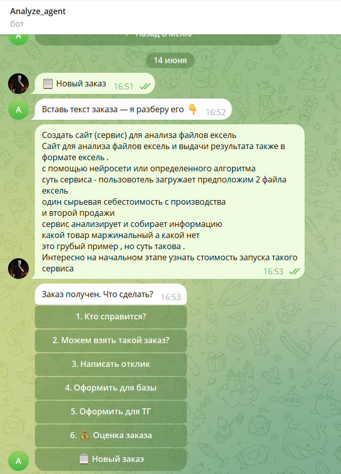
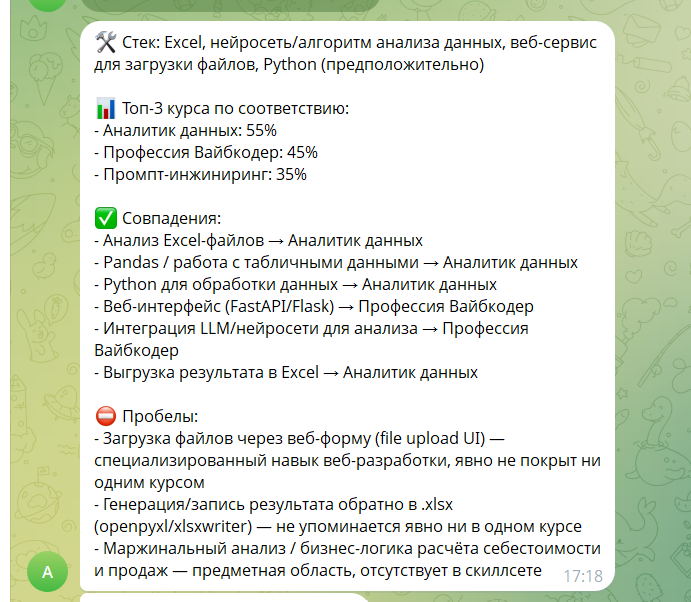
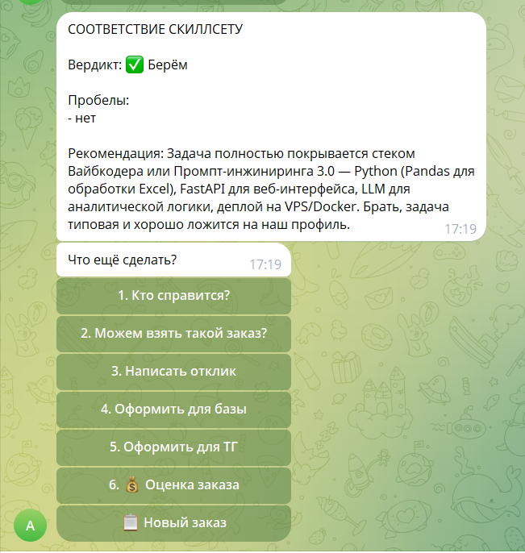
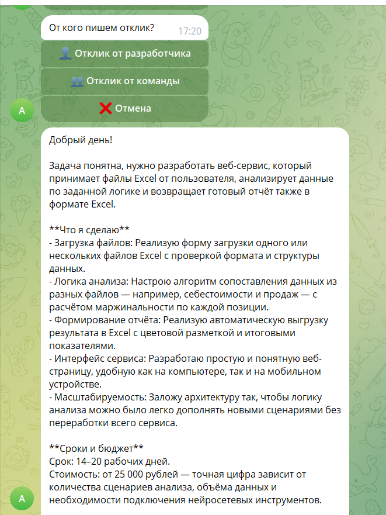
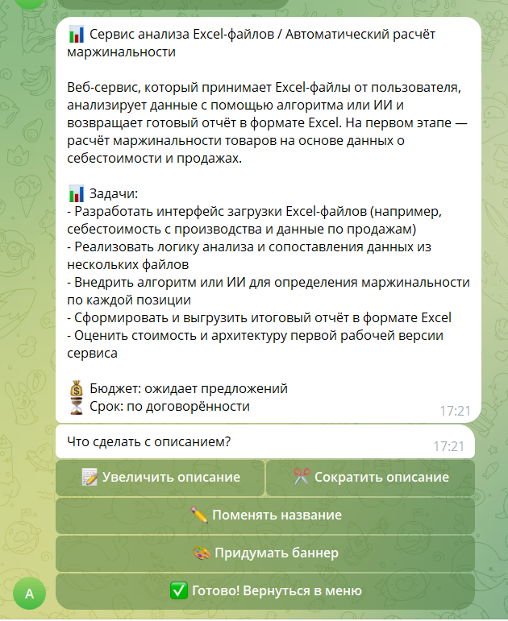
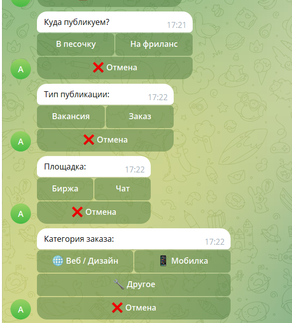
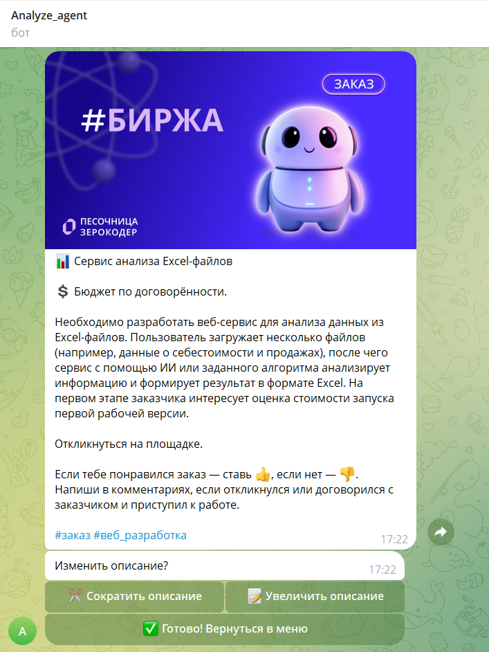

# Бот для анализа фриланс-заказов

Telegram-бот для карьерного центра онлайн-университета Zerocoder. Помогает быстро разбирать входящие заказы с фриланс-бирж: определяет стек, проверяет соответствие команде, пишет отклик и готовит пост для Telegram-канала.

---

## Проблема

Ежедневно через карьерный центр проходит 10–20 заказов с Kwork, FL.ru и других площадок. Каждый нужно вручную проанализировать: определить технологии, проверить соответствие скиллсету команды, написать отклик и оформить для публикации. На один заказ уходило 15–20 минут. Бот сокращает это до 1–2 минут.

---

## Пользователь

Менеджеры карьерного центра — сотрудники, которые занимаются подбором заказов для студентов и выпускников no-code/low-code направлений.

---

## Что умеет бот

**На входе:** текст фриланс-заказа (скопированный с биржи).

**На выходе** — одно из пяти действий по выбору:

| Действие | Что получает пользователь |
|----------|--------------------------|
| 🛠 Определить стек | Список технологий + топ-3 курса Zerocoder с % соответствия |
| ✅ Проверить соответствие | Вердикт (брать / не брать), пробелы, рекомендация |
| ✍️ Написать отклик | Готовый текст отклика для заказчика |
| 📋 Оформить для базы | Структурированная карточка заказа для внутренней базы |
| 📢 Оформить для ТГ | Пост с автоматически подобранным баннером |

---

## Технологии

- **Python 3.11**
- **aiogram 3** — фреймворк для Telegram-ботов
- **Anthropic API (Claude Sonnet 4.6)** — языковая модель для анализа
- **aiosqlite** — хранение истории и состояний FSM
- **structlog** — структурированное логирование
- **pydantic-settings** — управление конфигурацией через `.env`

---

## Запуск

### 1. Клонировать репозиторий

```bash
git clone https://github.com/YOUR_USERNAME/freelance-order-analyzer.git
cd freelance-order-analyzer
```

### 2. Установить зависимости

```bash
pip install -r requirements.txt
```

### 3. Настроить `.env`

Скопировать `.env.example` в `.env` и заполнить значения:

```bash
cp .env.example .env
```

```env
TELEGRAM_BOT_TOKEN=your_bot_token_from_botfather
ANTHROPIC_API_KEY=sk-ant-...
ALLOWED_USER_IDS=123456789,987654321
HF_TOKEN=your_hf_token
```

Где получить:
- `TELEGRAM_BOT_TOKEN` — создать бота через [@BotFather](https://t.me/BotFather)
- `ANTHROPIC_API_KEY` — на [console.anthropic.com](https://console.anthropic.com) → API Keys
- `ALLOWED_USER_IDS` — Telegram ID пользователей, которым разрешён доступ (узнать через [@userinfobot](https://t.me/userinfobot))
- `HF_TOKEN` — токен Hugging Face (для агента-исследователя)

### 4. Запустить бота

```bash
py -3.11 -m bot.main
```

Бот работает локально — держите терминал открытым. Найдите бота в Telegram и отправьте `/start`.

---

## Структура проекта

```
analyz_agent/
├── bot/                    # Telegram-бот
│   ├── handlers/           # Обработчики команд и callback-кнопок
│   ├── keyboards/          # Инлайн-клавиатуры
│   ├── states/             # Состояния FSM
│   ├── config.py           # Конфигурация
│   ├── main.py             # Точка входа
│   └── storage.py          # SQLite-хранилище для FSM
├── ai/                     # Логика работы с Claude
│   ├── agents/             # Claude-агенты
│   ├── prompts/            # Промпты для каждого действия
│   ├── analyzer.py         # Оркестратор анализа
│   └── client.py           # Клиент Anthropic API
├── services/               # Бизнес-логика
│   ├── banner_service.py   # Подбор баннеров по типу поста
│   ├── history_service.py  # История заказов
│   └── order_processor.py  # Обработка заказов
├── utils/                  # Утилиты
│   ├── skillset_loader.py  # Загрузка скиллсета курсов
│   ├── text.py             # Форматирование текста
│   └── url_fetcher.py      # Получение контента по URL
├── banners/                # Баннеры для Telegram-постов
├── .env.example            # Пример конфигурации
└── requirements.txt
```

---

## Скриншоты

### Старт и ожидание заказа


### Определение стека с топ-3 курсов


### Проверка соответствия скиллсету


### Готовый отклик для заказчика


### Оформление для внутренней базы


### Выбор типа поста для Telegram


### Готовый пост с баннером


---

## Итоговый проект

Разработан в рамках финального проекта курса по вайб-кодингу на Claude Code (Zerocoder).  
Автор: Елена Нигматулина
